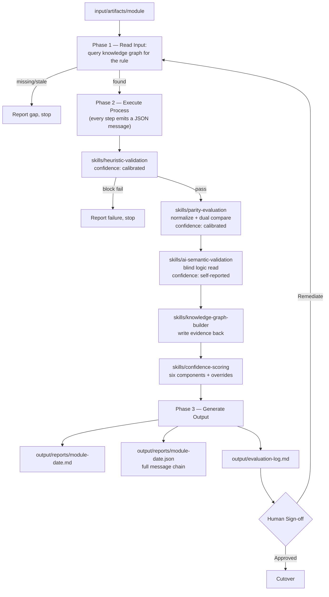

# ParityKit

An agent + skills framework for evaluating AI-generated artifacts in legacy modernization work. One orchestrating agent reads an artifact under test, runs it through a versioned skills library, and generates a test report with a transparent, evidence-based confidence score — precision, recall, accuracy, and F1 included, never a bare number.

**Version 3.0.0.** Every inter-skill handoff is a typed JSON message with an explicit confidence indicator — see "Skill messages" below.

## Architecture



Two independent oracles feed `parity-evaluation`: the **golden dataset** (empirical) and the **rule-engine implementation** (analytical, independently maintained). `ai-semantic-validation` then checks something neither oracle can: whether the artifact's actual *logic*, read independently and blind, matches the documented rule — because a numeric match proves agreement on the cases tested, not that the rule was actually implemented.

## Skill messages

Every skill hands off its result as one JSON object matching `context/schemas/skill-message.schema.json`, always including a `confidence` block (`value`, `band`, `basis`, `source`). Two source types exist, and they are not interchangeable:

- **`calibrated`** — a number derived by formula from measured evidence (oracle coverage, a heuristic's track record, sample completeness). Used by every skill except one.
- **`self-reported`** — a model's own certainty in its own reading. Used only by `ai-semantic-validation`. Self-reported confidence can lower a downstream score; it can **never** raise one.

Full explanation and worked examples in `skills/SKILL_MESSAGES.md`. Every run writes its complete message chain to `output/reports/{module}-{date}.json` alongside the human-readable `.md` report.

## Skills library

Each skill is a folder with a versioned `SKILL.md` (frontmatter contract + procedure + output message example) and a `REFERENCE.md` (pattern catalogs, formulas, worked examples — loaded only when the skill runs, kept out of routine context). See `SKILLS_CHANGELOG.md` for full version history.

| Skill | Version | Does | Confidence source |
|---|---|---|---|
| `legacy-rule-extraction` | 2.0.0 | Rule-based regex parsing of legacy source into draft rule candidates | calibrated |
| `knowledge-graph-builder` | 2.0.0 | The only skill that writes to the graph — TTL in git, synced to Neo4j | calibrated |
| `heuristic-validation` | 2.0.0 | Cheap deterministic sanity checks, run first, can halt the pipeline | calibrated |
| `ai-semantic-validation` | 2.0.0 | Independent AI read of the artifact's logic, cross-checked against the rule and the parity result | **self-reported** |
| `parity-evaluation` | 2.0.0 | Normalize, then dual-compare against both oracles; computes precision/recall/accuracy/F1 | calibrated |
| `confidence-scoring` | 2.0.0 | Six-component weighted score with hard overrides; enforces the self-reported propagation rule | calibrated |

## Folder structure

```
.github/
  copilot-instructions.md
  chatmodes/
    parity-auditor.chatmode.md      # orchestrator: read input -> execute process -> generate output
    blindspot-scout.chatmode.md     # coverage/recall exposure across a scope
  prompts/
    run-full-evaluation.prompt.md
    scan-blindspots.prompt.md
    score-confidence.prompt.md
  instructions/
    migration-context.instructions.md
skills/
  SKILL_MESSAGES.md                 # the shared JSON envelope, explained
  legacy-rule-extraction/{SKILL.md, REFERENCE.md}
  knowledge-graph-builder/{SKILL.md, REFERENCE.md}
  heuristic-validation/{SKILL.md, REFERENCE.md}
  ai-semantic-validation/{SKILL.md, REFERENCE.md}
  parity-evaluation/{SKILL.md, REFERENCE.md}
  confidence-scoring/{SKILL.md, REFERENCE.md}
input/
  README.md
  artifacts/{module}/            # <- drop the artifact under test here
output/
  README.md
  reports/{module}-{date}.md     # <- generated human-readable test report
  reports/{module}-{date}.json    # <- full JSON message chain for that run
  evaluation-log.md              # <- append-only audit trail
context/
  knowledge-graph.ttl            # source of truth, git-tracked
  normalization-rules.md
  schemas/skill-message.schema.json
  neo4j/{schema,import,queries}.cypher
  golden-datasets/
  rules-engine/
  legacy-source/
checklists/
  parity-checklist.md
  regression-blindspot-checklist.md
BEST_PRACTICES.md
SKILLS_CHANGELOG.md
VERSION
```

## The confidence score

Six components, always shown with their breakdown — never a bare number:

| Component | Weight |
|---|---|
| Context Completeness | 15% |
| Parity F1 | 25% |
| Semantic Agreement | 20% |
| Blind-Spot Coverage | 20% |
| Recall Floor | 10% |
| Review Status | 10% |

Four conditions cap the score at Low regardless of the weighted total — missing context, zero blind-spot coverage on a financial rule, zero recall, or a flagged **coincidental match risk**. That last one is the framework's central guarantee: a 100% parity match rate is never sufficient evidence on its own. Full rationale in `skills/confidence-scoring/REFERENCE.md`.

## Quickstart

1. Copy this folder into your repo — chat modes appear in Copilot's mode dropdown once `.github/chatmodes/` exists.
2. Populate `context/knowledge-graph.ttl` with your first human-confirmed rules (via `legacy-rule-extraction` + manual review), load into Neo4j with `context/neo4j/schema.cypher` then `import.cypher`.
3. Add a golden dataset and, where a rule is well-understood, a rule-engine implementation under `context/`. A rule with only one oracle is weaker evidence than one with two — the framework will say so.
4. Drop the artifact under test into `input/artifacts/{module}/`.
5. Run `*run-full-evaluation {module}` — the Parity Auditor walks all three phases, all six skills, and writes the full JSON message chain automatically.
6. Check `output/reports/` for the full report and `output/evaluation-log.md` before any sign-off conversation.
7. Periodically run `*scan-blindspots {scope}` in Blind-Spot Scout mode — even on modules that just passed. Passing and covered are different claims.

## What this is deliberately not

Not a scoring model, not an ML classifier, not an autonomous approver. Every number in the confidence score is arithmetic over evidence a human can re-run as a Cypher query or re-read as a JSON message. Sign-off authority stays with a named human owner at every tier above Low risk. Read `BEST_PRACTICES.md` before modifying any skill or agent file — it documents the design decisions (single writer to the graph, fail-closed defaults, why semantic validation is mandatory, why self-reported confidence can only ever pull a score down) that keep this framework honest as it grows.
