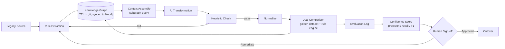

# ParityKit

A minimal, markdown-and-graph-native framework for catching parity failures and regression blind spots in legacy modernization work — built to run inside GitHub Copilot. Two agent personas, a knowledge graph as the shared context, and an evidence-based confidence score, all pointed at one job: don't let AI-assisted transformation claim confidence it can't prove.

## Architecture



Two independent oracles feed the dual comparison, not one: the **golden dataset** (empirical — real historical legacy output) and the **rule engine** (analytical — an independently maintained, deterministic re-implementation of the same business rule). Agreement between both and the AI-generated output is strong evidence. Disagreement between the two oracles is itself a finding, not a tie the AI's output gets to silently win.

## The four things this framework enforces

1. **Context check.** No module gets assessed until the relevant knowledge-graph nodes are confirmed present and fresh — queried from Neo4j, sourced from `knowledge-graph.ttl` in git.
2. **Rule-based validation before comparison.** A cheap, deterministic heuristic check runs first and can stop the pipeline outright. Only normalized output — rounding, dates, encoding, field order all canonicalized — ever reaches the comparison stage, so formatting noise never gets mistaken for a defect.
3. **Confidence score, five components, always shown with its breakdown.** Context completeness, parity F1, blind-spot coverage, a standalone recall floor, and review status. One critical gap caps the whole score at Low, regardless of the average.
4. **Evaluation pipeline.** Every run — heuristic check, comparison, blind-spot scan, confidence score — writes back into the graph and into `evaluation-log.md`, the append-only audit trail a human reviewer signs off against.

## Why precision and recall, not just a match rate

Precision is cheap to inflate: flag less, and precision goes up while real defects slide through unflagged. Recall is what actually costs effort to earn, and it's the number a demo will never volunteer — a high-recall check finds more of its own problems, which looks worse in a walkthrough than a system that simply stopped looking. So the rubric scores them separately: a **Recall Floor** component exists specifically so a good precision number can't quietly buy a passing confidence band on a module that's barely been checked. Any rule with no heuristic check, no rule-engine oracle, and no parity check contributes **zero** to recall — not "unknown," zero.

## Folder structure

```
.github/
  copilot-instructions.md          # loaded on every request — short, points to everything else
  chatmodes/
    parity-auditor.chatmode.md     # runs heuristic → normalize → dual-compare, scores confidence
    blindspot-scout.chatmode.md    # finds uncovered nodes, reports recall exposure
  prompts/
    run-parity-check.prompt.md     # the full three-stage pipeline, end to end
    scan-blindspots.prompt.md
    score-confidence.prompt.md
  instructions/
    migration-context.instructions.md   # scoped to src/migration/**
parity/
  knowledge-graph.ttl               # source of truth — rules, oracles, evidence links, in git
  neo4j/
    import.cypher                   # loads the TTL into Neo4j via neosemantics (n10s)
    queries.cypher                  # blind-spot, staleness, context-assembly, precision/recall queries
  normalization-rules.md            # canonicalization applied before any comparison
  rules-engine/                     # independent, deterministic re-implementations — the second oracle
  golden-datasets/                  # historical production data, one set per module
  checklists/
    parity-checklist.md             # pass criteria + five-component confidence rubric
    regression-blindspot-checklist.md
  evaluation-log.md                 # audit trail, append-only
```

## Quickstart

1. Copy this folder into your repo. The chat modes appear in Copilot's mode dropdown once `.github/chatmodes/` exists.
2. Populate `parity/knowledge-graph.ttl` with your first extracted business rules before transforming any code — the graph comes first, not after. Load it into Neo4j with `parity/neo4j/import.cypher`.
3. For each rule, write both a golden dataset (`parity/golden-datasets/`) and, where the rule is well-understood enough, a deterministic rule-engine implementation (`parity/rules-engine/`) — a rule with only one oracle is weaker evidence than a rule with two.
4. Switch to **Parity Auditor** mode and run `*run-parity {module}` — it walks heuristic check → normalize → dual comparison automatically and logs precision/recall/F1.
5. Switch to **Blind-Spot Scout** mode and run `*scan-blindspots {scope}`, even on modules that just passed — passing and covered are different claims — and check the recall exposure figure it reports.
6. Check `parity/evaluation-log.md` before any sign-off conversation. If it's not in the log, it wasn't evaluated.

## What this is deliberately not

Not a scoring model, not an ML classifier, not an autonomous approver. The confidence score is arithmetic over evidence a human can re-run themselves as a Cypher query. Sign-off authority stays with a named human owner at every tier above Low risk. The framework's only job is to make sure a claim of "reliable" has a paper trail behind it, and to make silence — missing checks, missing oracles, missing context — visible instead of invisible.
